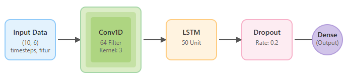
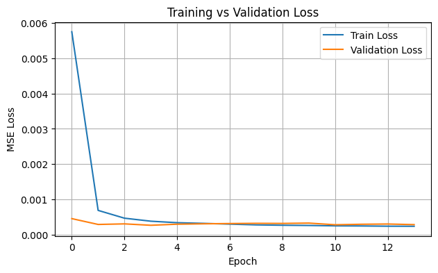
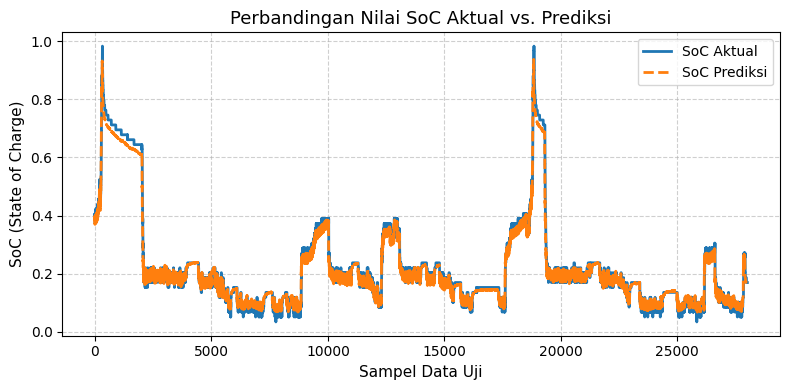
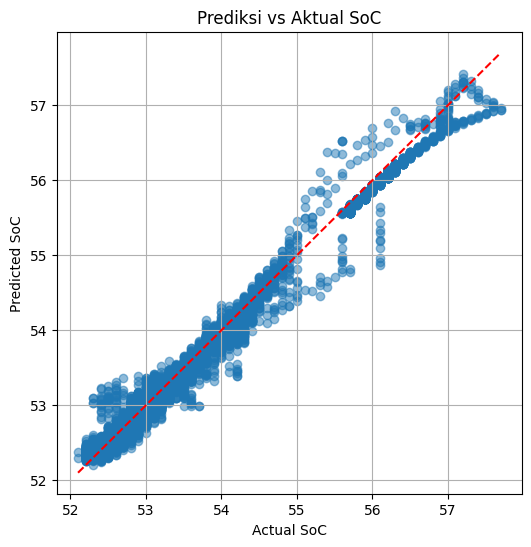
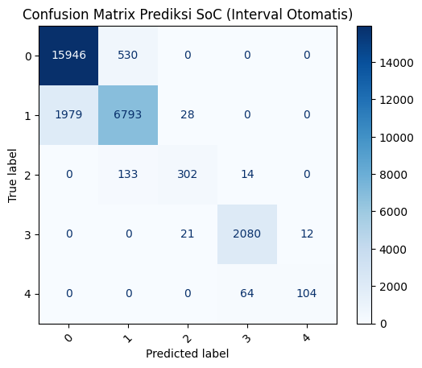

# 🔋 Lightweight Hybrid CNN-LSTM for Battery SoC Estimation

**Author:** Regan Agam (NIM: 24/PTK/552177/16439)  
**Program:** Master's in Electrical Engineering, Universitas Gadjah Mada (UGM)  
**Course:** Teknik Klasifikasi dan Pengenalan Pola (Pattern Recognition and Classification Techniques)

## 📌 Project Overview
Estimasi *State of Charge* (SoC) yang akurat adalah pilar fundamental dalam Sistem Manajemen Baterai (BMS) untuk kendaraan listrik (EV). Proyek ini mengusulkan dan mengevaluasi arsitektur *hybrid* CNN-LSTM yang ringkas untuk prediksi SoC. Model dievaluasi melalui pendekatan ganda: sebagai tugas **Regresi** untuk memprediksi nilai kontinu, dan sebagai tugas **Klasifikasi** untuk mengkategorikan rentang kondisi baterai.

## 📊 Dataset & Preprocessing
Dataset yang digunakan adalah dataset primer *time-series* dari parameter operasional baterai yang bersumber dari file `Book45.xlsx`.
* **Total Data:** 186.715 baris data.
* **Fitur Input (6 Fitur):** `voltage`, `current`, `temp 1`, `temp 2`, `temp 3`, `temp 4`.
* **Variabel Target:** `SOC`.

**Preprocessing Pipeline:**
1. **Normalisasi:** Seluruh fitur input dan target dinormalisasi ke rentang [0, 1] menggunakan `MinMaxScaler`.
2. **Sequence Generation:** Data diubah menjadi sekuens yang tumpang tindih dengan panjang 10 *timesteps* untuk memprediksi nilai SoC pada langkah waktu berikutnya.
3. **Data Split:** Dataset dibagi secara time-aware menjadi data latih (70%), data validasi (20%), dan data uji (10%).

## 🧠 Model Architecture (Lightweight Design)
Model ini mengintegrasikan lapisan Conv1D untuk ekstraksi fitur spasial dan lapisan LSTM untuk menangkap dependensi temporal. Arsitektur ini dirancang secara spesifik agar sangat efisien dengan total hanya **23.415 parameter**, menjadikannya solusi praktis untuk perangkat keras keras *edge* BMS.

* **Input Layer:** Menerima sekuens data berdimensi (10, 6).
* **Conv1D Layer:** 64 filter, kernel size 3, aktivasi ReLU.
* **LSTM Layer:** 50 unit, aktivasi ReLU.
* **Dropout Layer:** Rate 0.2 untuk regularisasi.
* **Dense Layer:** 1 neuron output.

## 📈 Results: Regression Performance
Evaluasi regresi menunjukkan tingkat akurasi yang luar biasa dalam memprediksi nilai kontinu SoC.

| Metric | Score |
| :--- | :---: |
| **Mean Squared Error (MSE)** | 0.0124 |
| **R-squared ($R^2$)** | 0.9870 |

### Training Dynamics
Kurva *validation loss* bergerak secara paralel dengan *training loss* dan mencapai konvergensi pada nilai yang sangat rendah, menjadi indikator kuat bahwa model memiliki kemampuan generalisasi yang baik dan tidak *overfitting*.

### Time-Series Prediction Tracking
Kurva prediksi berimpit hampir sempurna dengan kurva aktual, mengonfirmasi kemampuan model dalam melacak dinamika temporal seperti fase *charging*, *discharging*, serta perubahan-perubahan kecil yang terjadi.

### Prediction Consistency (Scatter Plot)
Titik data membentuk klaster yang sangat rapat di sepanjang garis diagonal, membuktikan korelasi yang sangat kuat dan performa yang tidak bias di seluruh rentang SoC (rendah, sedang, maupun tinggi).

## 📊 Results: Classification Performance
Kemampuan model juga dinilai dalam mengkategorikan status baterai ke dalam 5 kelas interval SoC secara otomatis. 

| Metric | Score |
| :--- | :---: |
| **Accuracy** | 90.07% |
| **Macro Avg Precision** | 0.90 |
| **Macro Avg Recall** | 0.90 |
| **Macro Avg F1-Score** | 0.90 |

### Confusion Matrix
Sebagian besar prediksi berada di sepanjang diagonal utama (prediksi benar). Kesalahan klasifikasi minor yang terjadi umumnya hanya berada pada kelas-kelas yang saling berdekatan.

## 💡 Key Engineering Insights
Mencapai kecocokan $R^2$ sebesar 0.9870 pada regresi dan akurasi 90.07% pada klasifikasi dengan model berparameter sangat ringan (~23k) membuktikan bahwa arsitektur Hybrid CNN-LSTM ini tidak hanya akurat secara prediktif, tetapi juga andal dan siap diimplementasikan untuk aplikasi BMS dunia nyata dengan komputasi terbatas.

## 🚀 How to Run
1. *Clone* repositori ini ke perangkat lokal Anda.
2. Buka *file* `TKPP.ipynb` menggunakan Jupyter Notebook atau Google Colab.
3. Anda dapat membaca laporan teknis komprehensif pada *file* `Regan Agam_552177_LR_11102025.pdf` yang berada di dalam folder `docs/`.
